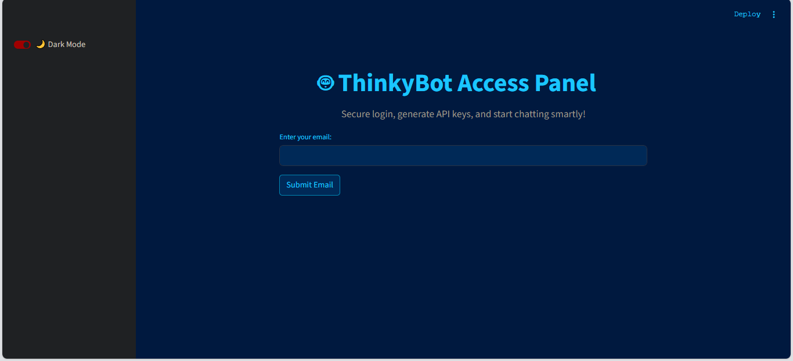

# 🤖 ThinkyBot: FastAPI + Streamlit Auth System for LLM 

A secure, developer-friendly authentication system built using **Streamlit**, **FastAPI**, and **Gemini 1.5 Flash**.  
Users can log in with OTP via email, generate unique API keys, and access an intelligent chatbot through a protected `/chat` API.

---

## 🚀 Features

- 🔐 OTP login system with email verification (Gmail SMTP)
- 🗝️ Unique API key generation (viewable only once)
- 🧼 API key deletion, listing, and usage tracking
- ⚡ FastAPI backend with Gemini-powered chatbot endpoint
- 🌙 Light & Dark mode toggle with custom UI styling
- 📊 Real-time API usage display
- 🧪 Includes a simple test `client.py` for local testing

---

## ⚙️ Tech Stack

- `Streamlit` — frontend UI
- `FastAPI` — API server
- `Gemini 1.5 Flash` — LLM backend
- `SQLite3` — database
- `dotenv` — for environment configs

---

## 🧠 Usage Guide

1. **📁 Clone the repo**

   ```bash
   git clone https://github.com/haidersjaf77/gemini-fastapi-chat.git
   cd gemini-fastapi-chat
   ```

2. **📦 Install dependencies**

   ```bash
   pip install -r requirements.txt
   ```

3. **🔧 .env Configuration**

Create a `.env` file in the root with the following:

```bash
GMAIL_EMAIL=your-email@gmail.com
GMAIL_APP_PASSWORD=your-app-password
GEMINI_API_KEY=your-gemini-key
ENVIRONMENT=dev
```
📝 Note: If your Gmail has 2FA enabled, `create an App Password`.

**4. 🖥️ Launch the Frontend**

```bash
streamlit run app.py
```

This opens the ThinkyBot Auth Portal in your browser.

**5. 📧 Login via OTP**
- Enter a supported email (@gmail.com, @yahoo.com, @outlook.com, etc.)
- Receive and enter the OTP to log in

**6. 🔑 Manage API Keys**
- ✅ Generate API keys with custom names
- 👀 View your API keys (only masked versions are shown)
- 🗑️ Delete any keys you no longer need

**7. 💬 Test the Chatbot**

Once logged in and with an API key:

```bash
python client.py
```

Or call the API directly:

POST `/chat`

```bash
{
"prompt": "Tell me a joke about AI and pizza",
"email": "you@example.com",
"api_key": "sk-user-abc123..."
}
```
---

## 📌 Notes

- API keys are shown only once. Copy and save them immediately.

- OTPs expire in 10 minutes

- All usage will be stored in a local `SQLite DB` (users.db)

- You can expand support to more domains by editing `SUPPORTED_DOMAINS `in `config.py`

---

## 📸 Preview

